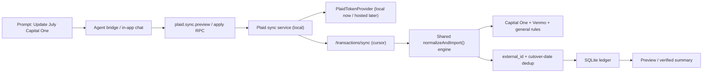

# Plaid Transaction Sync — Implementation Plan

> Status: **Proposal for review. No code changed.**
> Decisions locked (2026-07-23):
> 1. **Intent:** Personal tool now, product-ready later. Plaid secret stays local (macOS Keychain); token-exchange sits behind a swappable interface so a hosted companion service can drop in later without touching the import engine.
> 2. **Account model:** Map Plaid accounts **onto existing accounts** with a **hard cutover date** per account — no overlap window between CSV history and Plaid data.
> 3. **First live account:** Capital One card.
> 4. **Venmo:** stays CSV (Plaid's Venmo coverage is unreliable).
> 5. **Command surfaces:** support **both** in-app chat and the agent bridge (no cost advantage to either for syncing — see §2A).
> 6. **Sync application:** **confidence-gated auto-apply** — confident transactions apply silently, only ambiguous ones queue for review, and each resolution can write a rule (see §5A). Replaces blanket preview-before-apply.
> 7. **Fixtures received:** real Capital One + Venmo June 2026 exports provided; golden tests will use redacted versions of these shapes.

---

## 1. Guiding principles

- **Read-only, always.** The integration never moves money, pays bills, or changes bank settings. Plaid product scope is limited to `transactions`.
- **Deterministic writes, AI only for intent.** Categorization, dedup, and DB writes stay in local TypeScript. The AI layer (external JSON-RPC bridge and/or in-app chat) only interprets "update my July transactions" and reports results.
- **Additive, reversible migrations.** Every schema change is `ALTER TABLE ADD COLUMN` or a new table. Every mutating sync reuses the existing pre-write snapshot / `agent.undoLastWrite` machinery.
- **Byte-identical CSV behavior.** The shared-engine refactor must not change a single field of existing Capital One / Venmo import output. Golden tests enforce this.

---

## 2. Architecture (how this fits what already exists)

Scoop Money already has the command layer the original plan assumed it needed to build: a local **JSON-RPC 2.0 agent bridge** (`src/main/agentBridge.ts`, catalog in `src/main/agentBridgeCore.ts`) that an external agent drives over `127.0.0.1` with a bearer token, plus an in-app chat (`src/main/ai.ts`). Plaid actions become new catalog methods; the "one prompt" flow is `plaid.sync.preview` → `plaid.sync.apply`.



### The `PlaidTokenProvider` seam (product-ready-later)

A single interface isolates *where secrets live* from *everything else*:

```
interface PlaidTokenProvider {
  createLinkToken(institution?): Promise<{ linkToken: string }>
  exchangePublicToken(publicToken): Promise<{ itemId: string }>   // access token never leaves the provider
  getAccessToken(itemId): Promise<string>                         // local impl: Keychain read
}
```

- **Now (local impl):** Plaid `client_id` + `secret` read from macOS Keychain in the Electron main process. Access tokens encrypted at rest via Keychain. Nothing ships in the binary.
- **Later (hosted impl):** same interface, backed by a companion service that owns the production secret and returns short-lived material. The import engine, bridge methods, and UI don't change.

> ⚠️ **Do not ship a Plaid Production secret inside the Electron app** — it is trivially extractable, and Plaid Production onboarding effectively forbids it. That is *the* reason commercialization eventually needs the hosted provider. This design defers that cost without blocking it.

---

## 2A. AI cost & command surfaces

**The sync itself uses no AI and costs nothing** — regardless of surface or frequency. Plaid fetch → normalize → rule-map → dedup → write is all deterministic local code (`applyRulesToCategory`, `mapCapitalOneCategory`, `mapVenmoCategory`). AI is only involved if a sync is triggered by a free-form natural-language command, which is optional.

| Trigger | AI used? | Cost |
|---|---|---|
| "Update now" button / scheduled auto-sync | No | **$0** |
| NL command in in-app chat (`ai.ts`) | Yes — your Anthropic/OpenAI **API key** | Small per-command charge, already metered in `aiUsageCost.ts` |
| NL command via agent bridge (Claude Code) | Yes — Claude Code subscription | No API-key credits; billed to that plan |

**Decision:** primary controls are deterministic and free (a "Update now" button + optional scheduled auto-sync). Natural-language commands are offered in **both** surfaces as convenience. There is no cost saving from the bridge vs. in-app for syncing — both are free when button-driven; the only difference is the optional NL-parsing layer.

---

## 3. The cutover-date reconciliation model

This is the subtle core of the "map onto existing accounts" decision. It eliminates the overlap window instead of trying to reconcile it.

- Add `plaid_cutover_date` (unix seconds) per account.
- **Before the cutover:** CSV history is the source of truth. Existing rows are never touched by Plaid.
- **On/after the cutover:** Plaid is the source of truth for that account.
- **Enforcement in the shared engine:**
  - CSV import of an account with a cutover date **skips rows dated ≥ cutover** (and surfaces a "these are now handled by Plaid" notice).
  - Plaid sync **applies only transactions dated ≥ cutover** by default.
- **Result:** the two data sources never cover the same day, so Plaid dedup relies solely on `external_id` (provider transaction id), and existing CSV dedup logic stays exactly as-is for the pre-cutover era.
- **Optional backfill (not default):** a first Plaid sync *can* fetch older history, but replacing pre-cutover CSV rows is an explicit, separate opt-in — never automatic.

For Capital One specifically: you pick a cutover date (e.g. the 1st of the month you connect), CSV stops there, Plaid owns everything after.

---

## 4. Schema changes (additive)

**`transactions`** (`src/main/database.ts`)
- `external_id TEXT` — Plaid `transaction_id` (nullable; CSV rows stay null).
- `source` gains `'plaid'`. Update `TransactionSource` in `src/types/money.ts` and the `source` allow-list in `agentBridge.ts` (`validateTransaction`, currently manual/ai/csv_import).
- Optional provenance: `provider_pending INTEGER`, `original_description TEXT`, `merchant_name TEXT`, `pfc TEXT` (Plaid `personal_finance_category`) — stored for explainable, correctable categorization.
- New unique index on `(account_id, external_id)` where `external_id IS NOT NULL`.

**`accounts`**
- `plaid_cutover_date INTEGER` (nullable).

**New tables**
- `plaid_items` — institution, `PlaidTokenProvider` item reference, health/error state, sync **cursor**.
- `plaid_accounts` — Plaid account id ↔ Scoop account id mapping.
- `plaid_transaction_links` — Plaid txn id ↔ local txn id, pending/posted state, last provider update (drives safe pending→posted relinking via `pending_transaction_id`).
- *(Deferred)* `plaid_sync_runs` — full run audit. Start with lightweight logging; add the table when needed.

---

## 5. Phased delivery

Each phase is an independently shippable PR with a hard exit criterion.

| PR | Scope | Exit criterion |
|----|-------|----------------|
| **1** | **Shared import engine.** Split `importTransactionsFromFile` (`src/main/importer.ts:42`) into `readRows()` → `normalizeAndImport(records, {provider, accountId})`. Extract Venmo rules (`mapVenmoCategory`) and Capital One mappings into the shared path *without behavior change*. | Golden fixtures from real Capital One + Venmo exports produce **byte-identical** output vs. today. |
| **2** | **Provenance migration.** All schema changes in §4. Add `plaid_cutover_date` + engine enforcement. No Plaid network calls yet. | Migrations apply cleanly on an existing DB; CSV imports still identical; cutover skip logic unit-tested. |
| **3** | **Plaid Sandbox.** `PlaidTokenProvider` (local impl), `/transactions/sync` cursor loop, wire through shared engine. New bridge methods: `plaid.status`, `plaid.link.begin`, `plaid.link.complete`, `plaid.accounts.list`, `plaid.sync.preview`, `plaid.sync.apply`, `plaid.sync.retry`, `plaid.disconnect`. Settings "Connected Accounts" UI (connect / map / cutover date / last sync / preview / apply). | Sandbox handles Link, pagination, `added` / `modified` / `removed`, and pending→posted with no duplicates. Cursor persists only after every page succeeds. |
| **4** | **First live Capital One account.** Preview-before-apply; apply creates a normal backup + `agent.undoLastWrite` snapshot. | On a real account: preview is accurate, reconciliation clean at the cutover boundary, undo restores. |
| **5** | **One-prompt updates.** Teach the command layer: "update my July [Capital One] transactions" → scope to month + account → preview → apply per safety mode; "what changed?"; "undo that sync". | "Update July transactions" is reliable and auditable end-to-end. |
| **6** | *(Optional, later)* Editable Venmo rules engine; background sync / webhooks; hosted `PlaidTokenProvider`. | Only after on-demand is proven stable. |

---

## 5A. Sync application model — confidence-gated auto-apply + learning loop

Replaces blanket preview-before-apply. Ordinary syncs are **silent for the clear majority** and only interrupt you where a transaction is genuinely ambiguous.

- **Confident → auto-apply silently.** A rule matched, or the deterministic mapping is high-confidence.
- **Ambiguous → "Needs Review" queue; never written to the ledger silently.** Ambiguous means any of:
  - no rule matched and the mapping falls through to `Uncategorized` / `"Other"`;
  - conflicting signals (a local rule says X, Plaid `personal_finance_category` strongly says Y);
  - a brand-new merchant with no mapping history;
  - a Plaid `modified` / `removed` change that would overwrite a row the user hand-edited;
  - income-candidate uncertainty (a positive Venmo/credit that might be income).
- **Review UI** shows the raw evidence (description, merchant, Plaid category, amount, sign) + the app's best guess, and lets you set the category. On resolve it prompts **"Always map [merchant / pattern] → [category]?"** and, if accepted, writes an `import_transaction_rule` or `category_mapping_rule` via the existing `rules.create` path — so the same ambiguity auto-resolves next time. Learning loop.

**Real ambiguities in the provided June 2026 fixtures** (motivating the queue):
- `ADOBE *ADOBE` and `OPENAI *CHATGPT SUBSCR` (Capital One category "Merchandise") currently map to **Shopping** — they are subscriptions. Queue catches → one rule each.
- `TST*TOSCANO BROTHERS` (category "Other") falls through to Uncategorized → queue.
- Venmo `Film ⛽ +$33` (received) is **not** flagged an income candidate — "film" isn't in the income-keyword list (`importer.ts:394`) — despite being photography income → queue surfaces the uncertain positive amount.

This model supersedes the earlier "preview every sync." Preview remains available on demand ("preview changes") but is not the default path.

---

## 6. Plaid specifics to get right

- Use **`/transactions/sync`** (cursor), not date-range `/transactions/get`.
- Feed **`personal_finance_category`** (Plaid's current taxonomy) into the rules engine as the raw category; store `original_description` + `merchant_name` so any classification is explainable/correctable.
- **Pending → posted:** relink via `pending_transaction_id`; update in place, never create a second row.
- **Modified:** update provider-derived fields *unless* the user has manually reclassified locally (respect a per-row override flag).
- **Removed:** mark reversed for review; never silently delete a user-edited row.
- **Cursor safety:** persist only after a full successful page sequence, so partial failures restart cleanly.
- Ordinary syncs must **not** run "re-categorize all" — that stays explicit.

---

## 7. Testing

- Unit: shared pipeline + rule ordering (Capital One override → default mapping → general rules; Venmo note rules).
- **Golden:** Capital One + Venmo CSV outputs unchanged (gate for PR 1).
- Plaid Sandbox: Link, pagination, modified, removed, pending→posted.
- Migration + rollback.
- Cutover-boundary: CSV rows ≥ cutover skipped; Plaid rows < cutover skipped; no overlap dupes.
- Live smoke: connect → "update July" → inspect preview → apply → read back rows → undo, in a disposable profile.

---

## 8. Prerequisites that are yours to do (I can't)

- **Create the Plaid developer account** and obtain Sandbox/Development `client_id` + `secret` (account creation / credential entry is on you — I'll wire up reading them from Keychain, never hardcode them).
- Decide the **Capital One cutover date** when we reach PR 3/4.
- For eventual commercialization: privacy policy, Plaid Production security questionnaire, and end-user disclosure copy.

---

## 9. Open questions — status

1. ~~Real export fixtures~~ — **Resolved.** Capital One + Venmo June 2026 exports received; redacted versions become the golden fixtures in PR 1.
2. ~~Command surface~~ — **Resolved.** Both in-app chat and agent bridge; primary path is a free deterministic button/auto-sync (see §2A).
3. ~~Preview UX~~ — **Resolved.** Confidence-gated auto-apply with a Needs-Review queue and rule-learning; preview available on demand only (see §5A).

**Auto-sync cadence** — **Resolved.** Auto-sync runs **on every app launch**, plus a prominently displayed **manual "Sync now / Refresh" button in Settings** (Connected Accounts). Scheduled interval sync is a later option, not required.

Remaining to calibrate during the build (not blocking):
- **Confidence threshold tuning** — exactly which mappings count as "confident" vs. queue-worthy; will calibrate against the fixtures during PR 1.
